# ComplexAnimation
一个复杂的动画效果（有个公司的面试考核）

### 仿写动图
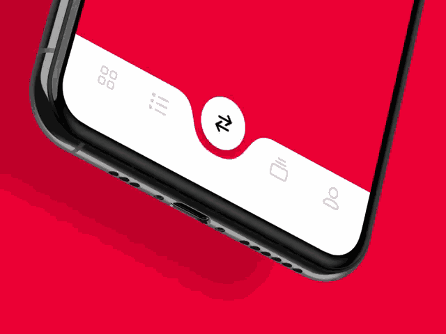<br>
### 实现的动图
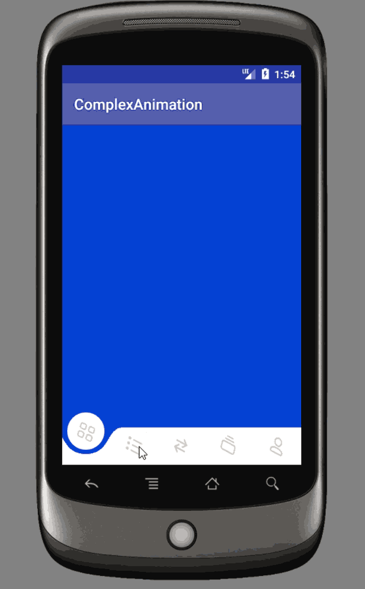<br>

### 实现步骤
* 1.自定义ViewGroup，摆5个导航Button。<br>
    * 下面的为部分代码，主要是为了说明流程，详细代码请看[NavigationBarView.kt](https://github.com/chengxiaobo2/ComplexAnimation/blob/master/app/src/main/java/com/example/cheng/complexanimation/view/NavigationBarView.kt)。
        ```java
        class NavigationBarView : ViewGroup {
            //5个View
            private val navigationButtonListView = ArrayList<View>()

            //提供添加5个导航Button的方法
            fun addImageButtons(views: List<View>) {
                for (i in 0 until views.size) {
                    val frameLayout = FrameLayout(context)
                    val view = views.get(i)
                    super.addView(frameLayout)
                    navigationButtonListView.add(frameLayout)
                    frameLayout.addView(view)
                    val params = view.layoutParams as FrameLayout.LayoutParams
                    params.gravity = Gravity.CENTER
                    frameLayout.setOnClickListener {
                        if (currentIndex == i) {
                            return@setOnClickListener
                        }
                        currentIndex = i
                        Toast.makeText(context, i.toString(), Toast.LENGTH_SHORT).show()
                    }
            }

            //layout
            override fun onLayout(changed: Boolean, l: Int, t: Int, r: Int, b: Int) {
                if (childCount <= 0) {
                    return
                }
                for (i in 0 until navigationButtonListView.size) {
                    val view = navigationButtonListView.get(i)
                    view.layout(i * navigationButtonWidth, navigationTop, (i + 1) * navigationButtonWidth, navigationTop + navigationBottom)
                }
            }

            //记得measureChildren，因为我们继承的是ViewGroup
            override fun onMeasure(widthMeasureSpec: Int, heightMeasureSpec: Int) {
                super.onMeasure(widthMeasureSpec, heightMeasureSpec)
                measureChildren(widthMeasureSpec, heightMeasureSpec)

                navigationWidth = MeasureSpec.getSize(widthMeasureSpec)
                setMeasuredDimension(MeasureSpec.getSize(widthMeasureSpec), navigationHeight)
            }
        }
        ```
    * 效果如下:<br>
    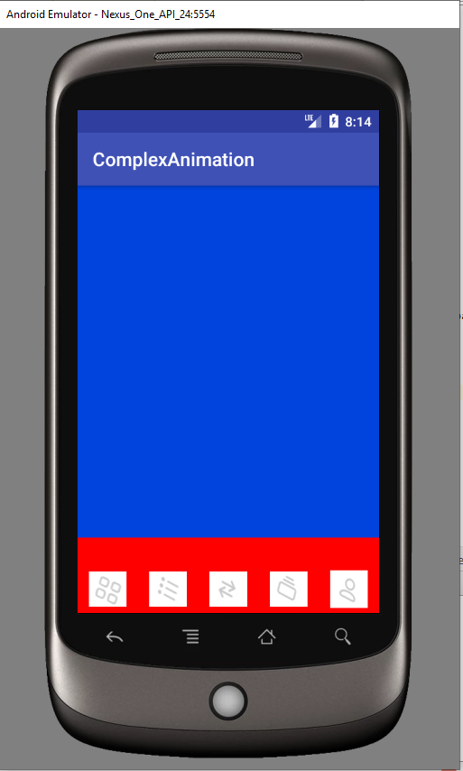<br>
* 2.实现球状View。
  * 2.1 自定义球状View
   AnimationGroup.kt
   ```java
    /**
    *  执行动画的View(上下左右移动+旋转)
    *
    * @author chengxiaobo
    * @time 2019/6/13 20:27
    */
    class AnimationGroup : FrameLayout {

        constructor(context: Context?) : super(context) {
            init()
        }

        constructor(context: Context?, attrs: AttributeSet?) : super(context, attrs) {
            init()
        }

        constructor(context: Context?, attrs: AttributeSet?, defStyleAttr: Int) : super(context, attrs, defStyleAttr) {
            init()
        }

        private fun init() {
            LayoutInflater.from(context).inflate(R.layout.circle_animation, this)
        }

        fun setImageResouce(resouce: Int) {
            animationView.setImageResource(resouce)
        }

        fun getAnimationView(): View {
            return animationView
        }
    }
   ```
  * 2.2 摆放球状View
   NavigationBarView.kt
   ```java
   fun addImageButtons(views: List<View>) {
        removeAllViews()
        animationGroup = AnimationGroup(context)
        animationGroup?.setImageResouce(R.drawable.p_1)
        ... ...     
   }

   override fun onLayout(changed: Boolean, l: Int, t: Int, r: Int, b: Int) {
        animationGroup?.let {
            it.layout((navigationButtonWidth - it.measuredWidth) / 2, distanceTop, (navigationButtonWidth - it.measuredWidth) / 2 + it.measuredWidth, it.measuredHeight + distanceTop)
        }
    }
   ```
   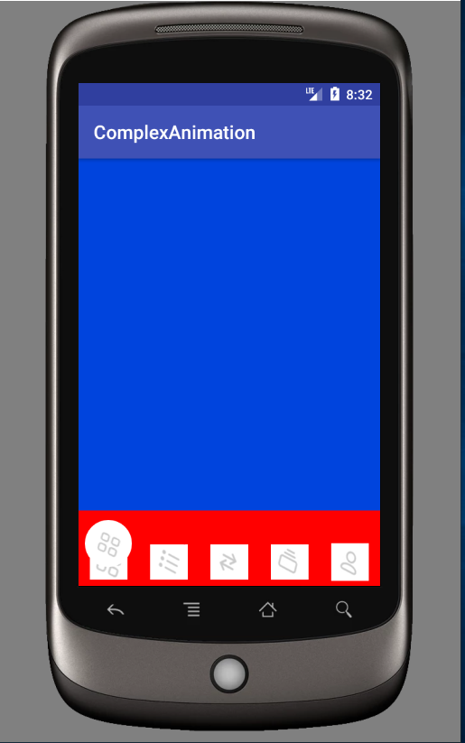<br>
  * 2.3 旋转动画
  ```java
    /**
    *  放大缩小动画
    *
    * @author chengxiaobo
    * @time 2019/6/13 17:52
    */
    class RotateAnimationManager : AnimationInterface {

        var view: View? = null
        private var animator: ObjectAnimator? = null
        private var onAnimationUpdate: AnimationUpdate? = null


        override fun startAnimation() {
            view?.let {
                if (animator == null) {
                    animator = ObjectAnimator.ofFloat(it, "rotation", 360.0f)
                }

                animator?.duration = 1000L
                animator?.start()
                animator?.addUpdateListener(object : ValueAnimator.AnimatorUpdateListener {
                    override fun onAnimationUpdate(animation: ValueAnimator) {
                        onAnimationUpdate?.onAnimationUpdate(animation.animatedFraction)
                    }
                })
            }
        }

        override fun stopAnimation() {
            view?.let {
                cancelAnimation()
            }
        }

        override fun cancelAnimation() {
            view?.let {
                animator?.cancel()
                it.scaleX = 1.0f
                it.scaleY = 1.0f
            }
        }

        override fun setAnimationUpdate(animationUpdate: AnimationUpdate) {
            this.onAnimationUpdate = animationUpdate
        }
    }
  ```
  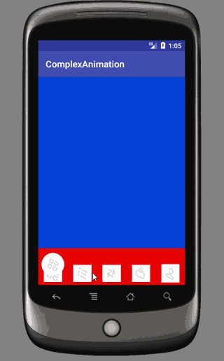<br>
  * 2.4 位移动画（如何实现呢？？？）<br>
    * 2.4.1. 刚开始想的是，一个translationX的动画，和一个translationY的动画。比较难的一点是，因为有可能一次移动1个button的距离，也有可能移动2个button的距离。那么TranstionY的动画（向下加向上）什么时候开始执行就是一个麻烦事了。后来考虑用抛物线函数去实现,这样就不用考虑向上动画什么时候执行了。
    * 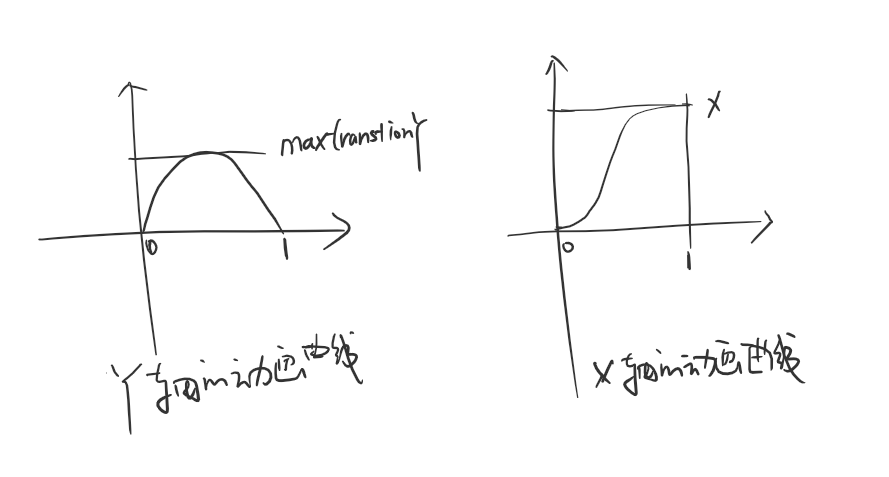<br>
    ```java
    /**
    * 位移的动画
    *
    * @author chengxiaobo
    * @time 2019/6/14 4:14
    */
    class TranslationAnimationManager(val startTranslateX: Float, val endTranslationX: Float, val startTranslateY: Float, val maxTranslationY: Float) : AnimationInterface {
        var view: View? = null
        private var animator: ValueAnimator? = null
        private var onAnimationUpdate: AnimationUpdate? = null


        override fun startAnimation() {
            view?.let {
                if (animator == null) {
                    animator = ValueAnimator.ofFloat(0.0f, 1.0f)
                }

                animator?.duration = 1000L
                animator?.start()
                animator?.interpolator = LinearInterpolator()
                animator?.addUpdateListener { animation ->
                    onAnimationUpdate?.onAnimationUpdate(animation.animatedFraction)
                    val t = animation.animatedFraction
                    //X方向为三角函数曲线的运动轨迹
                    val translationX = (-0.5f * Math.cos(t * Math.PI).toFloat() + 0.5f) * (endTranslationX - startTranslateX) + startTranslateX

                    val v0 = t * 2.0f - 1.0f
                    //y方向为抛物线的运动轨迹
                    val translationY = (-v0 * v0 + 1.0f) * (maxTranslationY - 0)

                    it.translationX = translationX
                    it.translationY = translationY
                }
            }
        }

        override fun stopAnimation() {
            view?.let {
                cancelAnimation()
            }
        }

        override fun cancelAnimation() {
            view?.let {
                animator?.cancel()
            }
        }

        override fun setAnimationUpdate(animationUpdate: AnimationUpdate) {
            this.onAnimationUpdate = animationUpdate
        }
    }
    ```
    * 最终效果
    * 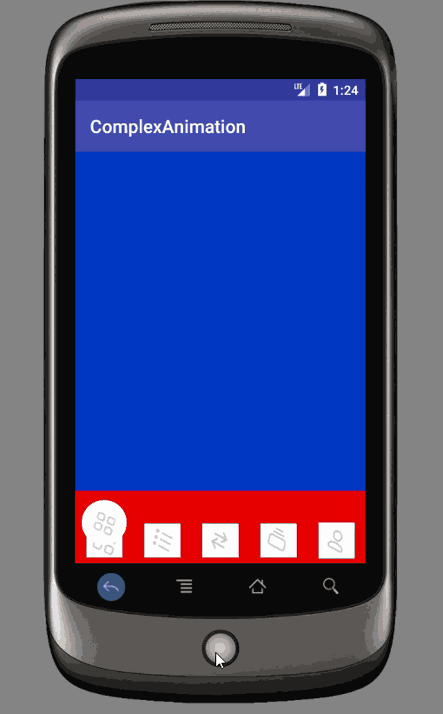<br>
* 3.根据小球的位置（小球的translationX的值），5个导航的Button要设置透明度，离小球比较近的button不显示，再远点的，透明度比较低，再远些显示。
  ```java
  translationAnimationManager?.setAnimationUpdate(object : AnimationUpdate {
                        var p = 0.0f
                        override fun onAnimationUpdate(precent: Float) {

                            if (p < 0.5f && precent >= 0.5f) {
                                it.setImageResouce(resouceList[i])
                            } else if (precent == 1.0f) {
                                rotateAnimationManager.startAnimation()
                            }
                            p = precent

                           // 根据transtionX的值，去设置5个View的透明度
                            animationGroup?.let {
                                val animationViewX = navigationButtonWidth / 2.0f + it.translationX

                                for (i in 0 until navigationButtonListView.size) {
                                    val view = navigationButtonListView.get(i)
                                    val centerX = (view.left + view.right) / 2.0f
                                    val d = Math.abs(animationViewX - centerX)
                                    if (d <= navigationButtonWidth * 0.75f) {
                                        view.alpha = 0.0f
                                    } else if (d >= navigationButtonWidth * 1.0f) {
                                        view.alpha = 1.0f
                                    } else {
                                        view.alpha = (d - navigationButtonWidth * 0.75f) / (navigationButtonWidth * (1.0f - 0.75f))
                                    }
                                }
                            }

                            band?.setFractionAndX(it.translationY / maxTranslationY.toFloat(), it.translationX + (it.left + it.right) * 0.5f)
                        }
                    })
  ```
  * 最终效果
  * 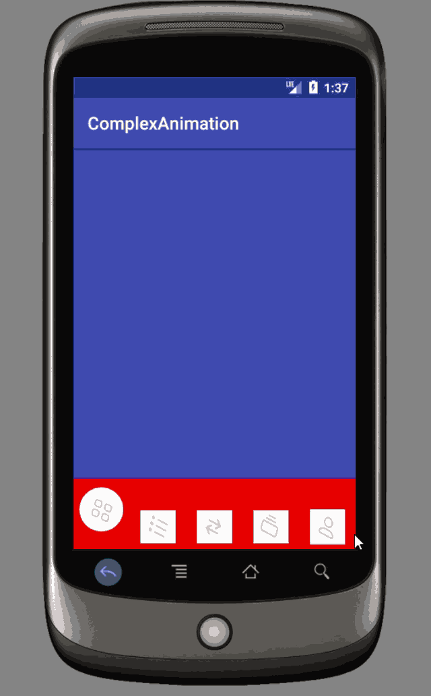<br>
* 4.画凹形状（贝塞尔曲线实现）<br>
  * 4.1 仔细观察要仿写的效果，发现凹形状是不一样的，当小球在上面的时候，凹的形状比较大，小球在下面的时候，凹的形状比较小。用程序的话就是说，凹的形状跟小球的translationY有关系。
  * 4.2 如何画白色的这个形状呢？分为7步<br>
  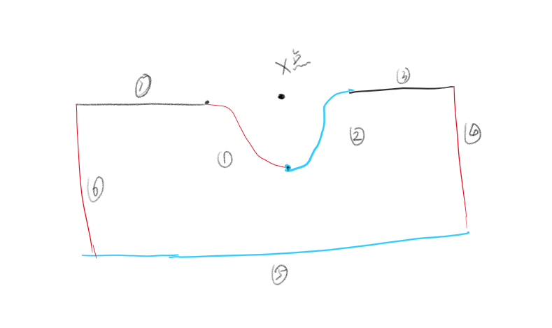<br>
  * 4.3 最难的一点是如何画两条贝塞尔曲线，如下图，这两条贝塞尔曲线为三阶贝塞尔曲线，最关键的是求出2和3这两个控制点的坐标（根据centerX 以及 小球的translationY）去求。<br>
  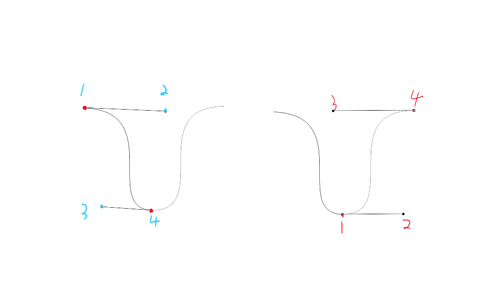<br>
  ```java
  /**
    * 画凹字形的曲线
    * @author guo
    */
    class Band : View {


        internal var _fraction: Float = 0.toFloat()
        internal var _x: Float = 0.toFloat()

        var _curveWidth0 = 340.0f
        var _curveWidth1 = 180.0f
        var _curveDepth0 = 120.0f
        var _curveDepth1 = 75.0f
        var _curveControlA0 = 80.0f
        var _curveControlA1 = 40.0f
        var _curveControlB0 = 115.0f
        var _curveControlB1 = 50.0f

        internal var _paint = Paint()
        internal var _path = Path()

        constructor(context: Context?) : super(context) {
            init()
        }

        constructor(context: Context?, attrs: AttributeSet?) : super(context, attrs) {
            init()
        }

        constructor(context: Context?, attrs: AttributeSet?, defStyleAttr: Int) : super(context, attrs, defStyleAttr) {
            init()
        }

        private fun init() {
            _curveWidth0 = getPx(context, 340.0f)
            _curveWidth1 = getPx(context, 180.0f)
            _curveDepth0 = getPx(context, 120.0f)
            _curveDepth1 = getPx(context, 75.0f)
            _curveControlA0 = getPx(context, 80.0f)
            _curveControlA1 = getPx(context, 40.0f)
            _curveControlB0 = getPx(context, 115.0f)
            _curveControlB1 = getPx(context, 50.0f)
        }

        fun setParams(width0: Float, width1: Float, depth0: Float, depth1: Float, controlA0: Float, controlA1: Float, controlB0: Float, controlB1: Float) {
            _curveWidth0 = width0
            _curveWidth1 = width1
            _curveDepth0 = depth0
            _curveDepth1 = depth1
            _curveControlA0 = controlA0
            _curveControlA1 = controlA1
            _curveControlB0 = controlB0
            _curveControlB1 = controlB1
        }

        /**
        * 根据球的上下位置，画贝塞尔曲线。仔细观察移动的过程中 凹的形状是不一样的
        * 球在上面的时候凹形大，球在下面的时候凹形状小
        */
        fun setFractionAndX(fraction: Float, x: Float) {
            _fraction = fraction
            _x = x
            invalidate()
        }

        override fun onDraw(canvas: Canvas) {
            _path.reset()

            val width = _curveWidth0 + _fraction * (_curveWidth1 - _curveWidth0)
            val depth = _curveDepth0 + _fraction * (_curveDepth1 - _curveDepth0)
            val controlA = _curveControlA0 + _fraction * (_curveControlA1 - _curveControlA0)
            val controlB = _curveControlB0 + _fraction * (_curveControlB1 - _curveControlB0)

            val cl = _x - width * 0.5f
            val cr = _x + width * 0.5f

            val left = Math.min(cl, 0.0f)
            val right = Math.max(cr, getWidth().toFloat())
            val bottom = height.toFloat()

            _path.moveTo(cl, 0.0f)
            _path.cubicTo(cl + controlA, 0.0f, _x - controlB, depth, _x, depth)
            _path.cubicTo(_x + controlB, depth, cr - controlA, 0.0f, cr, 0.0f)
            if (right != cr) {
                _path.lineTo(right, 0.0f)
            }
            _path.lineTo(right, bottom)
            _path.lineTo(left, bottom)
            _path.lineTo(left, 0.0f)
            if (left != cl) {
                _path.lineTo(cl, 0.0f)
            }

            canvas.drawPath(_path, _paint)
        }

        init {
            _paint.color = -0x1
            _paint.style = Paint.Style.FILL
        }
    }
  ```
  * 4.4 简单分析一下上面的代码
     ```java
        var _curveWidth0 = 340.0f //曲线最大的宽度
        var _curveWidth1 = 180.0f //曲线最小的宽度
        var _curveDepth0 = 120.0f //曲线最大的深度
        var _curveDepth1 = 75.0f  //曲线最小的深度
        var _curveControlA0 = 80.0f //如下图，2最大X值
        var _curveControlA1 = 40.0f //如下图，2最小X值
        var _curveControlB0 = 115.0f //如下图，3最大X绝对值
        var _curveControlB1 = 50.0f  //如下图，3最小绝对值

        val width = _curveWidth0 + _fraction * (_curveWidth1 - _curveWidth0)
        val depth = _curveDepth0 + _fraction * (_curveDepth1 - _curveDepth0)
        val controlA = _curveControlA0 + _fraction * (_curveControlA1 - _curveControlA0)
        val controlB = _curveControlB0 + _fraction * (_curveControlB1 - _curveControlB0)

     ```
     都会根据小球的translationY/maxTranslationY=fraction 根据fraction的值来计算出，贝塞尔曲线的两个控制点的值，这样的话，就能实现，当小球在上面的时候，凹的形状比较大，小球在下面的时候，凹的形状比较小的效果了。<br>
     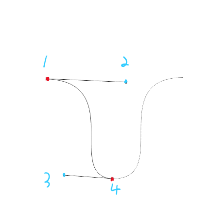<br>
  * 最终效果<br>
   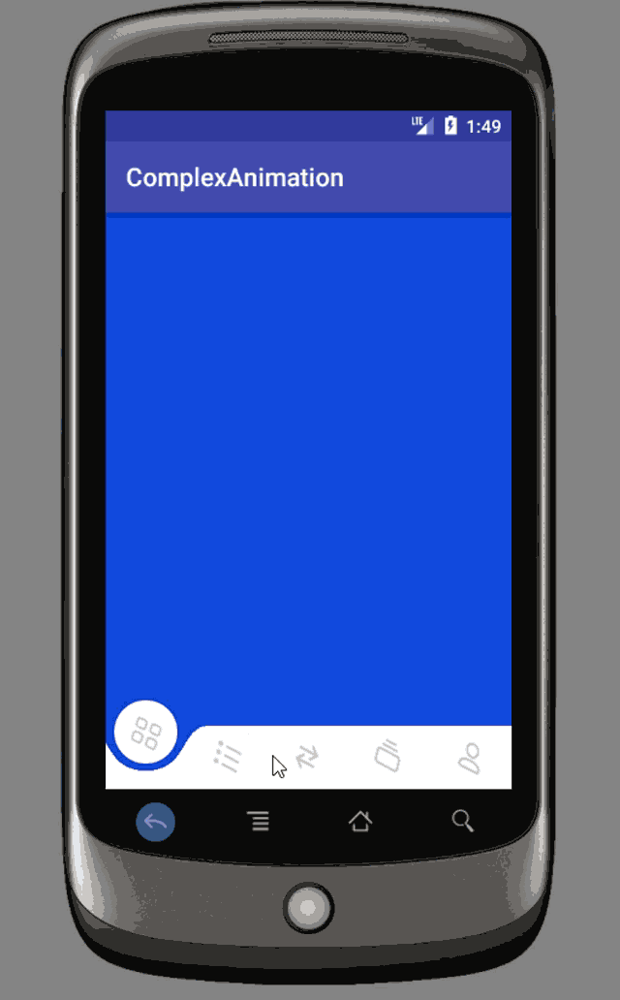<br>